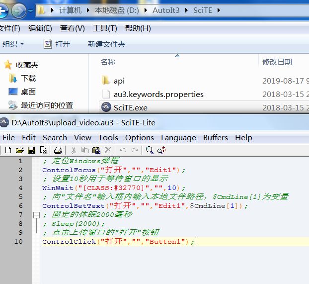

### 腾讯内容开放平台企鹅号视频自动上传
#### 开发工具：python、selenium、requests
    

 1. selenium版本因为上传的标签不是input所以，上传视频文件的路径不能直接发送
        因此需要借助AutolT三方工具，或使用pywin32模块来定位和处理Windows的弹框，
        还有一个比较麻烦的就是自己手动点可以一次性的选择五个视频进行上传，但是使
        用selenium的话只能选择一个一个的传，在定位网页分类选择标签的时候，无论怎
        么定位都不能定位到每一个视频下的分类标签，根据父节点的唯一属性去定位，最后
        定位的还是五个分类标签，所以这个比较麻烦，还有另外一种方法，根据id属性可以
        直接定位到select下拉列表，下拉列表包裹两层，optgroup下面包裹着option，这样
        可以在下拉列表里面进行选择分类，但是select标签的id属性是进行加密的，加密规则
        暂时没有搞明白
 #####autoIt辅助工具的代码

2. requests版本是最难搞的，各种加密算法，初始化发送get请求获取上传视频的请求参数，
	请求参数
                

```python
params = {
        'fileSize': os.path.getsize('视频路径'),	# 获取视频的大小
        'fileName': parse.quote('视频名称'), # 对视频名称进行urlencode编码
        'fileMd5': '视频md5加密',
        'fileSha': '视频sha1加密',
        'agreedSize': '1048576',
        'uploadSource': '10',
        'relogin': '1'
}
```
 这个请求参数只是开始的第一步，在进行视频上传的时候发送post请求，要对视频进行分片上传，
 上传的每一块视频都会进行sha1加密
```python
params = {
        'uploadKey': uploadKey,
        # 'fileName': parse.quote(filename),
        'fileName': filename,
        'fileSize': os.path.getsize(video_path),
        'offset': offset,
        'blockSize': blockSize,
        'blockSha': 'sha1加密'  # 对每一个块上传的视频进行sha1加密
                }
```
    
    把不同类别的视频，上传到对应的企鹅号上面进行发布
        1、体育类一个账号传两个类别，封面问题需要解决
        2、极限运动，需要写两个标签才能上传，其中有一个标签不能相同
        3、影视类，电视剧、电视剧剪辑，封面和标签问题需要解决
    
